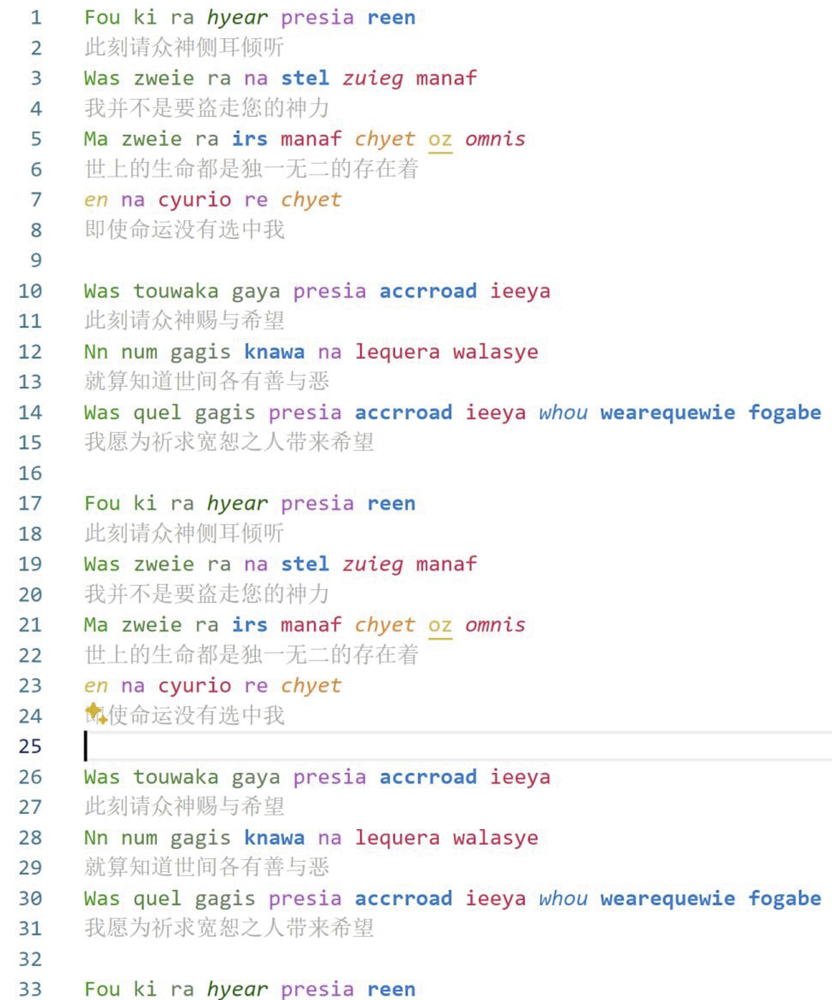
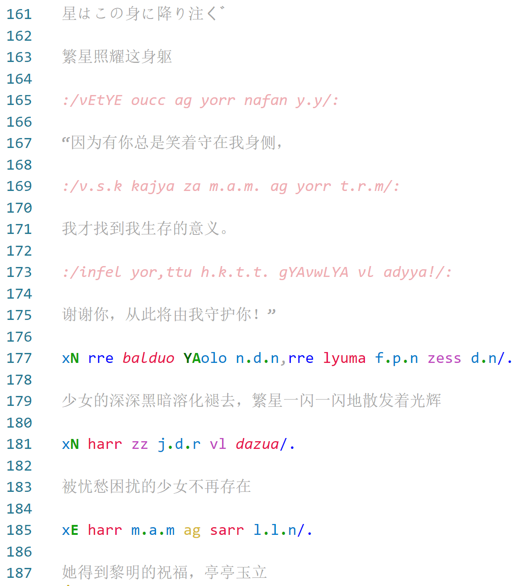

# hymmnos-language-support README

This is a VSCode plugin for Hymmnos syntax support, designed for syntax highlighting in Hymmnos.

## Screenshot

Standard Mode:  

Pastalie Mode:  

## Features

 - [x] Syntax highlighting for Hymmnos
 - [x] Supports both Standard and Pastalie modes
 - [x] Different colors for different parts of speech
 - [x] Supports if statements in Pastalie mode `Xc=foo->bar`
 - [x] Supports strings (double quotes) `:/foo bar/:`
 - [x] Supports comments, any content not in Hymmnos syntax will be marked as a comment

## Why Hymmnos?

This is a fun project—take it seriously and you lose!  
I simply wanted to see if it was possible to add custom syntax implementation to VSCode, and I chose Hymmnos syntax as a practice.  
Thus, this plugin was born.  

Hymmnos is a fictional language from the game series "Ar tonelico," with relatively straightforward grammatical rules.  
Its unique phonetic and conceptual styles set it apart from other fictional languages.  
The language of Pastalie is nearly unreadable when read directly, but its structure is highly regular, making it very suitable for practice with syntax highlighting.  
The language itself has a limited vocabulary and is not suitable for everyday communication.  
However, due to its phonetic nature, it produces beautifully lyrical effects, making it ideal for songwriting, poetry, and other artistic creations.  

**Have fun!**  

----

# hymmnos-language-support README

这是Hymmnos语法支持的VSCode插件，用于Hymmnos语法高亮显示。  

## Screenshot

标准律：  

新约律：  

## 功能特性

 - [x] Hymmnos语法高亮显示  
 - [x] 同时支持标准律 / 新约律  
 - [x] 对不同的词性拥有不同的颜色标注  
 - [x] 支持新约律if语句 `Xc=foo->bar`
 - [x] 支持字符串（双引号） `:/foo bar/:`
 - [x] 支持注释，任何不是Hymmnos语法的内容都会被标记为注释  

## 为什么要Hymmnos

这是一个整活项目，认真你就输啦！  
我纯粹就是想看看能不能给VSCode加一个自定义语法实现，然后顺便拿Hymmnos语法来练手，就有了这个插件。  

Hymmnos是游戏《Ar tonelico》系列中的虚构语言，其语法规则并不复杂。其独特的感音、想音风格使其和其他虚构语言有所不同。  
该语言的新约律直接阅读接近不可读状态，但结构十分规整，非常适合用于语法高亮显示的练手。  
其语言本身词汇量较少，无法用作日常的沟通交流。但是，正因为其感音语言的特性，其吟唱效果十分唯美，可以用作歌词填词、诗歌创作等。  

**祝玩得开心!**  
